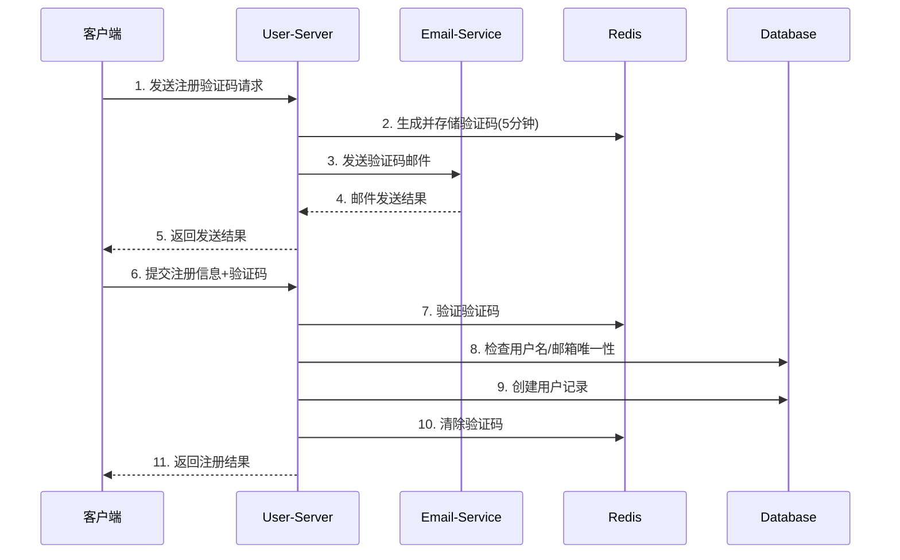
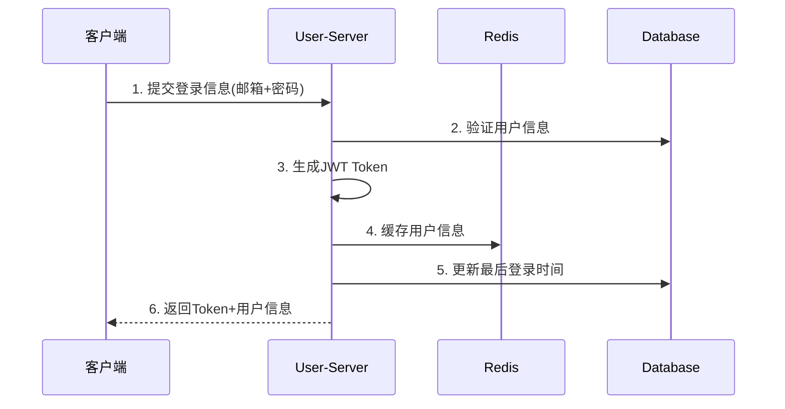
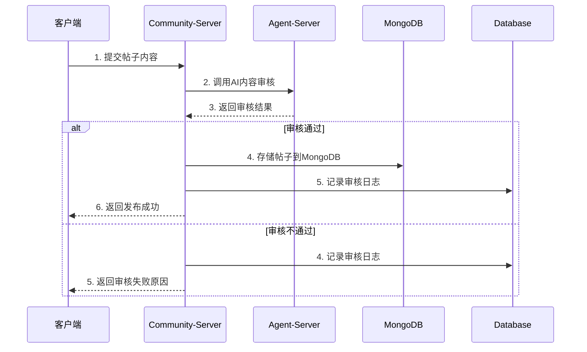
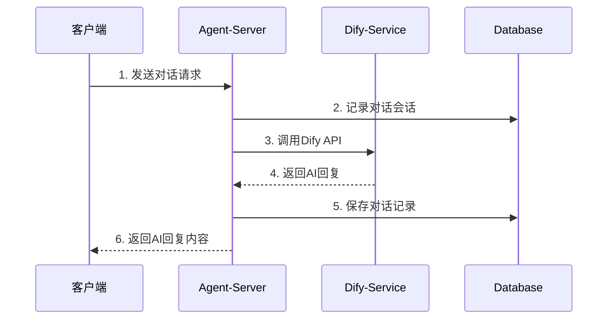
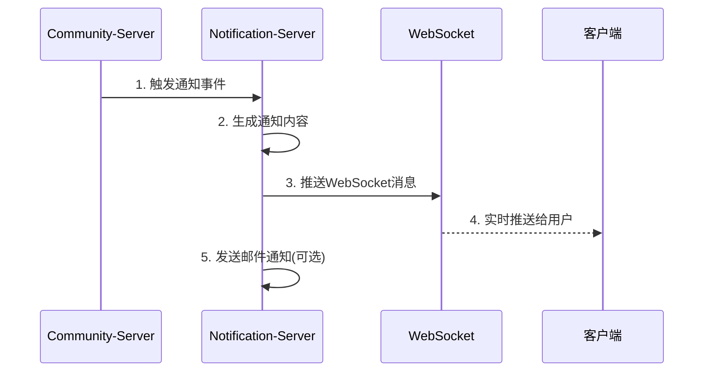

# 大学生社区平台 - 项目设计文档

## 📋 项目概述

**项目名称**: 大学生社区平台 (College Students Community Platform)  
**架构模式**: 微服务架构 + Spring Cloud  
**技术栈**: Spring Boot 3.x, MySQL, Redis, MongoDB, Nacos, Docker  
**部署方式**: 云服务器 + Docker 容器化  

## 🎯 项目目标

为大学生提供一个集学习交流、生活分享、社团活动、求职就业、二手交易、情感交友于一体的综合性社区平台，支持智能AI助手、内容审核、实时通知等功能。

---

## 🏗️ 系统架构

### 微服务架构图

```
┌─────────────────────────────────────────────────────────────┐
│                    API Gateway (8080)                      │
│                   - 路由转发                                │
│                   - 认证鉴权                                │
│                   - 限流熔断                                │
└─────────────────────┬───────────────────────────────────────┘
                      │
    ┌─────────────────┼─────────────────┐
    │                 │                 │
┌───▼───┐         ┌───▼───┐         ┌───▼───┐
│User   │         │Community│        │Notification│
│Server │         │Server  │        │Server  │
│8081   │         │8082    │        │8084    │
└───┬───┘         └───┬───┘         └───┬───┘
    │                 │                 │
┌───▼───┐         ┌───▼───┐         ┌───▼───┐
│Agent  │         │Config │         │Monitor│
│Server │         │Server │         │Tools  │
│8083   │         │8888   │         │       │
└───────┘         └───────┘         └───────┘
```

### 服务注册与发现

- **Nacos**: 服务注册中心 + 配置中心
- **服务地址**: `8.148.189.41:8848`
- **配置管理**: 统一配置管理，支持动态更新

### 数据存储架构

```
┌─────────────────┐    ┌─────────────────┐    ┌─────────────────┐
│     MySQL       │    │     Redis       │    │    MongoDB      │
│  关系型数据      │    │   缓存+会话     │    │   文档数据       │
│  - 用户信息      │    │  - 验证码       │    │  - 帖子内容     │
│  - 系统配置      │    │  - 用户会话     │    │  - 评论内容     │
│  - 审核记录      │    │  - 热点数据     │    │  - 消息记录     │
└─────────────────┘    └─────────────────┘    └─────────────────┘
```

---

## 🔄 核心业务流程

### 1. 用户注册与认证流程



#### 数据库表操作
- 验证码发送阶段：
  - verification_codes: INSERT 验证码; 校验时 SELECT by email+type+code; 过期清理 DELETE/由事件触发
  - system_configs: SELECT 邮件模板/配置（若从表获取）
  - email_logs: 发送邮件后 INSERT 发送记录，错误时 UPDATE status/错误信息
- 提交注册阶段：
  - users: SELECT 校验 username/email 唯一; INSERT 新用户; 注册成功后 UPDATE last_login（可延后）
  - verification_codes: SELECT 校验验证码有效; 注册完成后 UPDATE is_used=TRUE 或 DELETE 过期/使用完成
  - user_sessions: 可选 INSERT 初始会话（若注册即登录）
  - system_logs/audit_logs: INSERT 行为日志与审计记录

### 2. 用户登录与JWT认证流程



#### 数据库表操作
- users: SELECT by email 获取密码哈希/状态; 成功后 UPDATE last_login
- user_sessions: INSERT 新会话记录（token 哈希、设备、过期时间）; 心跳或访问时 UPDATE last_accessed; 登出或过期清理时 UPDATE is_active=FALSE 或 DELETE
- system_logs: INSERT 登录结果日志（INFO/ERROR）
- audit_logs: INSERT 登录操作审计（可选）

### 3. 帖子发布与内容审核流程



#### 数据库表操作
- content_reviews: AI 审核完成后 INSERT 审核记录（结果、模型、耗时、置信度）
- post_categories/tags: SELECT 基础配置（分类/标签存在性校验）；tags 命中时可调用存储过程 UpdateTagUsageCount 更新 use_count
- reports: 审核不通过时可 INSERT 自动举报记录（可选）
- system_logs/audit_logs: INSERT 发布/审核流程日志与审计

#### MongoDB 操作流程
```javascript
// 1. 创建帖子文档
db.posts.insertOne({
  authorId: NumberLong(userId),
  authorUsername: username,
  authorEmail: email,
  title: postTitle,
  content: postContent,
  images: imageUrls,
  tags: postTags,
  status: "PENDING",
  likeCount: 0,
  commentCount: 0,
  shareCount: 0,
  createdAt: new Date(),
  updatedAt: new Date()
});

// 2. AI 审核通过后更新状态
db.posts.updateOne(
  { _id: ObjectId(postId) },
  { 
    $set: { 
      status: "APPROVED", 
      reviewResult: "APPROVED",
      publishedAt: new Date(),
      updatedAt: new Date()
    }
  }
);

// 3. 更新标签使用统计
db.tags.updateMany(
  { name: { $in: postTags } },
  { $inc: { useCount: 1 }, $set: { updatedAt: new Date() } }
);
```

### 4. AI智能助手对话流程



#### 数据库表操作
- ai_conversations: 无对话或首次发起时 INSERT; 继续对话时 SELECT by conversation_id；结束时 UPDATE status/ended_at
- ai_messages: 每轮对话分别 INSERT USER 与 ASSISTANT 消息（含 metadata、token_count、耗时）
- content_reviews: 若启用对话内容安全审查，则 INSERT 审核记录（可选）
- system_logs: INSERT 关键步骤日志（调用 Dify、返回结果）

#### MongoDB 操作流程
```javascript
// 1. 创建或获取对话会话
let conversation = db.ai_conversations.findOne({ 
  conversationId: externalConversationId 
});

if (!conversation) {
  conversation = db.ai_conversations.insertOne({
    conversationId: externalConversationId,
    userId: NumberLong(userId),
    sessionId: sessionId,
    status: "ACTIVE",
    createdAt: new Date(),
    updatedAt: new Date()
  });
}

// 2. 保存用户消息
db.ai_messages.insertOne({
  conversationId: conversation._id,
  messageType: "USER",
  content: userMessage,
  metadata: { lang: "zh", channel: "web" },
  tokenCount: userTokenCount,
  processingTimeMs: 0,
  createdAt: new Date()
});

// 3. 保存AI回复消息
db.ai_messages.insertOne({
  conversationId: conversation._id,
  messageType: "ASSISTANT",
  content: aiResponse,
  metadata: { 
    model: "qwen2.5-7b", 
    temperature: 0.7,
    confidence: 0.95
  },
  tokenCount: aiTokenCount,
  processingTimeMs: responseTime,
  createdAt: new Date()
});

// 4. 更新对话状态（结束时）
db.ai_conversations.updateOne(
  { _id: conversation._id },
  { 
    $set: { 
      status: "ENDED", 
      endedAt: new Date(),
      updatedAt: new Date()
    }
  }
);
```

### 5. 实时通知推送流程



#### 数据库表操作
- notification_templates: SELECT 模板内容（标题/正文）
- email_logs: 邮件类通知 INSERT 记录，并在回执时 UPDATE status/sent_at/delivered_at
- system_configs: SELECT 通知与渠道开关配置
- system_logs: INSERT 推送状态日志

#### MongoDB 操作流程
```javascript
// 1. 创建通知记录
db.notifications.insertOne({
  receiverId: NumberLong(receiverId),
  title: notificationTitle,
  content: notificationContent,
  type: notificationType, // LIKE/COMMENT/FRIEND_REQUEST/MESSAGE
  priority: "NORMAL",
  category: notificationCategory,
  status: "UNREAD",
  expireAt: new Date(Date.now() + 7 * 24 * 60 * 60 * 1000), // 7天后过期
  createdAt: new Date(),
  updatedAt: new Date()
});

// 2. 批量创建通知（如点赞通知）
db.notifications.insertMany([
  {
    receiverId: NumberLong(postAuthorId),
    title: "新的点赞",
    content: `${likerName} 点赞了你的帖子《${postTitle}》`,
    type: "LIKE",
    priority: "LOW",
    category: "interaction",
    status: "UNREAD",
    createdAt: new Date()
  }
]);

// 3. 更新通知状态（用户已读）
db.notifications.updateMany(
  { 
    receiverId: NumberLong(userId),
    status: "UNREAD"
  },
  { 
    $set: { 
      status: "READ",
      updatedAt: new Date()
    }
  }
);

// 4. 清理过期通知
db.notifications.deleteMany({
  expireAt: { $lt: new Date() }
});

// 5. 获取用户未读通知
db.notifications.find({
  receiverId: NumberLong(userId),
  status: "UNREAD"
}).sort({ createdAt: -1 }).limit(20);
```

---

## 🔄 MongoDB 业务操作流程详解

### 1. 帖子评论操作流程

```javascript
// 1. 添加评论
db.comments.insertOne({
  postId: postId,
  authorId: NumberLong(userId),
  authorUsername: username,
  authorEmail: email,
  content: commentContent,
  parentCommentId: parentCommentId || null,
  likeCount: 0,
  createdAt: new Date(),
  updatedAt: new Date()
});

// 2. 更新帖子评论数
db.posts.updateOne(
  { _id: ObjectId(postId) },
  { $inc: { commentCount: 1 } }
);

// 3. 获取帖子的所有评论（分页）
db.comments.find({
  postId: postId,
  parentCommentId: null // 只获取顶级评论
}).sort({ createdAt: -1 })
  .skip((page - 1) * pageSize)
  .limit(pageSize);

// 4. 获取评论的回复
db.comments.find({
  parentCommentId: ObjectId(commentId)
}).sort({ createdAt: 1 });
```

### 2. 点赞操作流程

```javascript
// 1. 添加点赞
db.likes.insertOne({
  userId: NumberLong(userId),
  targetId: targetId, // 帖子ID或评论ID
  targetType: targetType, // POST 或 COMMENT
  createdAt: new Date()
});

// 2. 更新目标对象的点赞数
if (targetType === "POST") {
  db.posts.updateOne(
    { _id: ObjectId(targetId) },
    { $inc: { likeCount: 1 } }
  );
} else if (targetType === "COMMENT") {
  db.comments.updateOne(
    { _id: ObjectId(targetId) },
    { $inc: { likeCount: 1 } }
  );
}

// 3. 取消点赞
db.likes.deleteOne({
  userId: NumberLong(userId),
  targetId: targetId,
  targetType: targetType
});

// 4. 更新目标对象的点赞数（减少）
if (targetType === "POST") {
  db.posts.updateOne(
    { _id: ObjectId(targetId) },
    { $inc: { likeCount: -1 } }
  );
}

// 5. 检查用户是否已点赞
db.likes.findOne({
  userId: NumberLong(userId),
  targetId: targetId,
  targetType: targetType
});
```

### 3. 收藏操作流程

```javascript
// 1. 添加收藏
db.favorites.insertOne({
  userId: NumberLong(userId),
  postId: postId,
  createdAt: new Date()
});

// 2. 取消收藏
db.favorites.deleteOne({
  userId: NumberLong(userId),
  postId: postId
});

// 3. 获取用户收藏的帖子
db.favorites.find({
  userId: NumberLong(userId)
}).sort({ createdAt: -1 })
  .skip((page - 1) * pageSize)
  .limit(pageSize);

// 4. 检查用户是否已收藏
db.favorites.findOne({
  userId: NumberLong(userId),
  postId: postId
});
```

### 4. 好友关系操作流程

```javascript
// 1. 发送好友申请
db.friendships.insertOne({
  userId: NumberLong(userId),
  friendId: NumberLong(friendId),
  status: "PENDING",
  createdAt: new Date(),
  updatedAt: new Date()
});

// 2. 接受好友申请
db.friendships.updateOne(
  { 
    userId: NumberLong(friendId),
    friendId: NumberLong(userId),
    status: "PENDING"
  },
  { 
    $set: { 
      status: "ACCEPTED",
      updatedAt: new Date()
    }
  }
);

// 3. 创建双向好友关系
db.friendships.insertOne({
  userId: NumberLong(userId),
  friendId: NumberLong(friendId),
  status: "ACCEPTED",
  createdAt: new Date(),
  updatedAt: new Date()
});

// 4. 获取用户的好友列表
db.friendships.find({
  userId: NumberLong(userId),
  status: "ACCEPTED"
}).sort({ createdAt: -1 });

// 5. 获取待处理的好友申请
db.friendships.find({
  friendId: NumberLong(userId),
  status: "PENDING"
}).sort({ createdAt: -1 });
```

### 5. 私聊消息操作流程

```javascript
// 1. 发送消息
db.messages.insertOne({
  senderId: NumberLong(senderId),
  receiverId: NumberLong(receiverId),
  content: messageContent,
  messageType: "TEXT",
  status: "SENT",
  createdAt: new Date(),
  updatedAt: new Date()
});

// 2. 标记消息为已读
db.messages.updateMany(
  {
    senderId: NumberLong(senderId),
    receiverId: NumberLong(receiverId),
    status: { $ne: "READ" }
  },
  {
    $set: {
      status: "READ",
      updatedAt: new Date()
    }
  }
);

// 3. 获取两个用户之间的聊天记录
db.messages.find({
  $or: [
    { senderId: NumberLong(userId1), receiverId: NumberLong(userId2) },
    { senderId: NumberLong(userId2), receiverId: NumberLong(userId1) }
  ]
}).sort({ createdAt: 1 });

// 4. 获取用户的未读消息数
db.messages.countDocuments({
  receiverId: NumberLong(userId),
  status: "SENT"
});
```

### 6. 文件上传操作流程

```javascript
// 1. 记录文件上传
db.file_uploads.insertOne({
  uploaderId: NumberLong(userId),
  fileName: fileName,
  fileSize: fileSize,
  fileType: fileType,
  fileUrl: fileUrl,
  uploadPath: uploadPath,
  status: "COMPLETED",
  uploadedAt: new Date(),
  createdAt: new Date()
});

// 2. 获取用户上传的文件列表
db.file_uploads.find({
  uploaderId: NumberLong(userId)
}).sort({ uploadedAt: -1 });

// 3. 按文件类型筛选
db.file_uploads.find({
  uploaderId: NumberLong(userId),
  fileType: { $regex: "^image/" }
}).sort({ uploadedAt: -1 });
```

### 7. 热门内容查询流程

```javascript
// 1. 获取热门帖子（使用聚合管道）
db.posts.aggregate([
  { $match: { status: "APPROVED" } },
  { $sort: { likeCount: -1, createdAt: -1 } },
  { $limit: 20 },
  {
    $lookup: {
      from: "comments",
      localField: "_id",
      foreignField: "postId",
      as: "comments"
    }
  },
  {
    $addFields: {
      actualCommentCount: { $size: "$comments" }
    }
  }
]);

// 2. 获取用户活跃度统计
db.posts.aggregate([
  {
    $group: {
      _id: "$authorId",
      username: { $first: "$authorUsername" },
      postCount: { $sum: 1 },
      totalLikes: { $sum: "$likeCount" },
      lastPostDate: { $max: "$createdAt" }
    }
  },
  { $sort: { postCount: -1 } },
  { $limit: 10 }
]);

// 3. 获取标签使用统计
db.posts.aggregate([
  { $unwind: "$tags" },
  {
    $group: {
      _id: "$tags",
      usageCount: { $sum: 1 },
      avgLikes: { $avg: "$likeCount" }
    }
  },
  { $sort: { usageCount: -1 } }
]);
```

### 8. 全文搜索操作流程

```javascript
// 1. 搜索帖子（全文搜索）
db.posts.find({
  $text: { $search: searchKeywords },
  status: "APPROVED"
}).sort({ score: { $meta: "textScore" } });

// 2. 按标签搜索
db.posts.find({
  tags: { $in: [tagName] },
  status: "APPROVED"
}).sort({ createdAt: -1 });

// 3. 复合搜索（标题+内容+标签）
db.posts.find({
  $and: [
    { status: "APPROVED" },
    {
      $or: [
        { title: { $regex: searchKeywords, $options: "i" } },
        { content: { $regex: searchKeywords, $options: "i" } },
        { tags: { $in: [searchKeywords] } }
      ]
    }
  ]
}).sort({ createdAt: -1 });
```

---

## 🔗 业务流程与数据库表操作映射（汇总表）

### MySQL 数据库操作

- 用户注册/验证：
  - verification_codes: INSERT/SELECT/UPDATE/DELETE
  - users: SELECT（唯一性）/INSERT/UPDATE（last_login 可选）
  - email_logs: INSERT/UPDATE
  - system_logs, audit_logs: INSERT

- 用户登录/会话：
  - users: SELECT/UPDATE（last_login）
  - user_sessions: INSERT/UPDATE（last_accessed,is_active）/DELETE（过期）
  - system_logs, audit_logs: INSERT

- 内容发布/审核：
  - content_reviews: INSERT
  - post_categories, tags: SELECT；tags 使用计数通过存储过程更新
  - reports: INSERT（不通过时可选）
  - system_logs, audit_logs: INSERT

- AI 对话：
  - ai_conversations: INSERT/SELECT/UPDATE
  - ai_messages: INSERT
  - content_reviews: INSERT（启用安全审查时）
  - system_logs: INSERT

- 通知推送：
  - notification_templates: SELECT
  - email_logs: INSERT/UPDATE
  - system_configs: SELECT
  - system_logs: INSERT

### MongoDB 数据库操作

- 帖子发布/管理：
  - posts: INSERT（创建帖子）/UPDATE（状态更新）/FIND（查询帖子）
  - comments: INSERT（添加评论）/FIND（查询评论）/UPDATE（更新评论数）
  - likes: INSERT（点赞）/DELETE（取消点赞）/FIND（检查点赞状态）
  - favorites: INSERT（收藏）/DELETE（取消收藏）/FIND（查询收藏）

- 用户互动：
  - friendships: INSERT（好友申请）/UPDATE（接受申请）/FIND（好友列表）
  - messages: INSERT（发送消息）/UPDATE（标记已读）/FIND（聊天记录）
  - notifications: INSERT（创建通知）/UPDATE（标记已读）/DELETE（清理过期）

- 内容搜索/统计：
  - posts: AGGREGATE（热门帖子统计）/FIND（全文搜索）
  - tags: UPDATE（更新使用统计）/AGGREGATE（标签统计）
  - file_uploads: INSERT（文件记录）/FIND（文件列表）

- 数据维护：
  - notifications: DELETE（清理过期通知）
  - posts: UPDATE（更新统计数据）
  - 各集合: 定期清理和统计更新

---

## 🗄️ 数据库表设计详解

### 用户服务相关表 (User Service)

#### 1. `users` - 用户表
**作用**: 存储用户基本信息
```sql
- id: 用户唯一标识
- username: 用户名(唯一)
- email: 邮箱(唯一)
- password: 加密密码
- full_name: 真实姓名
- phone: 手机号
- role: 用户角色(ADMIN/TEACHER/STUDENT)
- status: 用户状态(ACTIVE/INACTIVE/SUSPENDED)
- created_at: 创建时间
- updated_at: 更新时间
- last_login: 最后登录时间
```

#### 2. `user_sessions` - 用户会话表
**作用**: 管理JWT Token和用户会话
```sql
- id: 会话ID
- user_id: 关联用户ID
- token_hash: Token哈希值
- device_info: 设备信息
- ip_address: IP地址
- expires_at: 过期时间
- is_active: 是否活跃
```

#### 3. `verification_codes` - 验证码表
**作用**: 存储邮箱验证码
```sql
- id: 验证码ID
- email: 邮箱地址
- code: 验证码
- type: 验证码类型(REGISTER/RESET_PASSWORD/CHANGE_EMAIL)
- expires_at: 过期时间
- is_used: 是否已使用
```

### 社区服务相关表 (Community Service)

#### 4. `post_categories` - 帖子分类表
**作用**: 管理帖子分类
```sql
- id: 分类ID
- name: 分类名称
- description: 分类描述
- icon: 分类图标
- sort_order: 排序
- is_active: 是否启用
```

#### 5. `tags` - 标签表
**作用**: 管理内容标签
```sql
- id: 标签ID
- name: 标签名称
- description: 标签描述
- color: 标签颜色
- use_count: 使用次数
```

#### 6. `user_follows` - 用户关注表
**作用**: 管理用户关注关系
```sql
- id: 关注ID
- follower_id: 关注者ID
- following_id: 被关注者ID
- created_at: 关注时间
```

#### 7. `reports` - 举报表
**作用**: 管理用户举报
```sql
- id: 举报ID
- reporter_id: 举报人ID
- target_type: 举报目标类型(POST/COMMENT/USER/MESSAGE)
- target_id: 举报目标ID
- reason: 举报原因(SPAM/INAPPROPRIATE/HARASSMENT/FAKE/OTHER)
- status: 处理状态(PENDING/PROCESSING/RESOLVED/REJECTED)
```

### 通知服务相关表 (Notification Service)

#### 8. `notification_templates` - 通知模板表
**作用**: 管理通知模板
```sql
- id: 模板ID
- name: 模板名称
- title_template: 标题模板
- content_template: 内容模板
- type: 通知类型(EMAIL/SMS/PUSH/IN_APP)
- category: 通知分类
- is_active: 是否启用
```

#### 9. `email_logs` - 邮件发送记录表
**作用**: 记录邮件发送历史
```sql
- id: 邮件ID
- to_email: 收件人邮箱
- subject: 邮件主题
- content: 邮件内容
- template_id: 模板ID
- status: 发送状态(PENDING/SENT/DELIVERED/FAILED/BOUNCED)
- sent_at: 发送时间
- delivered_at: 送达时间
```

#### 10. `system_configs` - 系统配置表
**作用**: 存储系统配置参数
```sql
- id: 配置ID
- config_key: 配置键
- config_value: 配置值
- description: 配置描述
- category: 配置分类
- is_encrypted: 是否加密
```

### Agent服务相关表 (Agent Service)

#### 11. `ai_conversations` - AI对话记录表
**作用**: 管理AI对话会话
```sql
- id: 对话ID
- conversation_id: 外部对话ID
- user_id: 用户ID
- session_id: 会话ID
- status: 对话状态(ACTIVE/ENDED/SUSPENDED)
- created_at: 创建时间
- ended_at: 结束时间
```

#### 12. `ai_messages` - AI对话消息表
**作用**: 存储AI对话消息
```sql
- id: 消息ID
- conversation_id: 对话ID
- message_type: 消息类型(USER/ASSISTANT/SYSTEM)
- content: 消息内容
- metadata: 元数据(JSON)
- token_count: Token数量
- processing_time_ms: 处理时间
```

#### 13. `content_reviews` - 内容审核记录表
**作用**: 记录AI内容审核结果
```sql
- id: 审核ID
- content_id: 内容ID
- content_type: 内容类型(POST/COMMENT/MESSAGE)
- content_text: 审核内容
- review_result: 审核结果(APPROVED/REJECTED/PENDING/NEEDS_HUMAN)
- review_reason: 审核原因
- confidence_score: 置信度分数
- ai_model: AI模型
- processing_time_ms: 处理时间
- reviewed_by: 审核人ID
```

### 系统监控相关表

#### 14. `system_logs` - 系统日志表
**作用**: 记录系统运行日志
```sql
- id: 日志ID
- level: 日志级别(DEBUG/INFO/WARN/ERROR/FATAL)
- logger_name: 日志记录器
- message: 日志消息
- exception_info: 异常信息
- user_id: 用户ID
- ip_address: IP地址
- user_agent: 用户代理
- request_id: 请求ID
- service_name: 服务名称
```

#### 15. `audit_logs` - 操作审计表
**作用**: 记录用户操作审计
```sql
- id: 审计ID
- user_id: 用户ID
- action: 操作动作
- resource_type: 资源类型
- resource_id: 资源ID
- old_values: 旧值(JSON)
- new_values: 新值(JSON)
- ip_address: IP地址
- user_agent: 用户代理
- service_name: 服务名称
```

---

## 🗄️ MongoDB 数据库集合设计详解

### 社区服务相关集合 (Community Service)

#### 1. `posts` - 帖子集合
**作用**: 存储社区帖子内容
```javascript
{
  _id: ObjectId,                    // 帖子唯一标识
  authorId: NumberLong,             // 作者用户ID
  authorUsername: String,           // 作者用户名
  authorEmail: String,              // 作者邮箱
  title: String,                    // 帖子标题
  content: String,                  // 帖子内容
  images: [String],                 // 图片URL数组
  tags: [String],                   // 标签数组
  status: String,                   // 状态(PENDING/APPROVED/REJECTED/DELETED)
  reviewResult: String,             // 审核结果
  likeCount: Number,                // 点赞数
  commentCount: Number,             // 评论数
  shareCount: Number,               // 分享数
  createdAt: Date,                  // 创建时间
  updatedAt: Date,                  // 更新时间
  publishedAt: Date                 // 发布时间
}
```

#### 2. `comments` - 评论集合
**作用**: 存储帖子评论内容
```javascript
{
  _id: ObjectId,                    // 评论唯一标识
  postId: String,                   // 关联帖子ID
  authorId: NumberLong,             // 评论者用户ID
  authorUsername: String,           // 评论者用户名
  authorEmail: String,              // 评论者邮箱
  content: String,                  // 评论内容
  parentCommentId: ObjectId,        // 父评论ID(回复评论)
  likeCount: Number,                // 点赞数
  createdAt: Date,                  // 创建时间
  updatedAt: Date                   // 更新时间
}
```

#### 3. `likes` - 点赞集合
**作用**: 存储用户点赞记录
```javascript
{
  _id: ObjectId,                    // 点赞记录唯一标识
  userId: NumberLong,               // 点赞用户ID
  targetId: String,                 // 目标ID(帖子ID或评论ID)
  targetType: String,               // 目标类型(POST/COMMENT)
  createdAt: Date                   // 点赞时间
}
```

#### 4. `favorites` - 收藏集合
**作用**: 存储用户收藏记录
```javascript
{
  _id: ObjectId,                    // 收藏记录唯一标识
  userId: NumberLong,               // 收藏用户ID
  postId: String,                   // 收藏的帖子ID
  createdAt: Date                   // 收藏时间
}
```

#### 5. `friendships` - 好友关系集合
**作用**: 存储用户好友关系
```javascript
{
  _id: ObjectId,                    // 好友关系唯一标识
  userId: NumberLong,               // 用户ID
  friendId: NumberLong,            // 好友用户ID
  status: String,                   // 关系状态(PENDING/ACCEPTED/REJECTED/BLOCKED)
  createdAt: Date,                  // 创建时间
  updatedAt: Date                   // 更新时间
}
```

#### 6. `messages` - 消息集合
**作用**: 存储用户私聊消息
```javascript
{
  _id: ObjectId,                    // 消息唯一标识
  senderId: NumberLong,            // 发送者用户ID
  receiverId: NumberLong,          // 接收者用户ID
  content: String,                 // 消息内容
  messageType: String,             // 消息类型(TEXT/IMAGE/FILE/LINK)
  status: String,                  // 消息状态(SENT/DELIVERED/READ)
  createdAt: Date,                 // 发送时间
  updatedAt: Date                  // 更新时间
}
```

#### 7. `notifications` - 通知集合
**作用**: 存储用户通知信息
```javascript
{
  _id: ObjectId,                    // 通知唯一标识
  receiverId: NumberLong,          // 接收者用户ID
  title: String,                   // 通知标题
  content: String,                 // 通知内容
  type: String,                    // 通知类型(GENERAL/SYSTEM/LIKE/COMMENT/FRIEND_REQUEST/MESSAGE)
  priority: String,                // 优先级(HIGH/NORMAL/LOW)
  category: String,                // 通知分类
  status: String,                 // 状态(UNREAD/READ)
  expireAt: Date,                 // 过期时间
  createdAt: Date,                // 创建时间
  updatedAt: Date                 // 更新时间
}
```

#### 8. `file_uploads` - 文件上传记录集合
**作用**: 存储文件上传记录
```javascript
{
  _id: ObjectId,                    // 文件记录唯一标识
  uploaderId: NumberLong,          // 上传者用户ID
  fileName: String,                // 文件名
  fileSize: Number,                // 文件大小(字节)
  fileType: String,                // 文件类型(MIME类型)
  fileUrl: String,                 // 文件访问URL
  uploadPath: String,              // 文件存储路径
  status: String,                  // 上传状态(PENDING/COMPLETED/FAILED)
  uploadedAt: Date,                // 上传时间
  createdAt: Date                 // 创建时间
}
```

### MongoDB 视图集合

#### 9. `hot_posts` - 热门帖子视图
**作用**: 聚合查询热门帖子
```javascript
// 基于 posts 集合的聚合视图
// 按点赞数和创建时间排序的热门帖子
```

#### 10. `user_activity_stats` - 用户活跃度统计视图
**作用**: 统计用户活跃度数据
```javascript
{
  _id: NumberLong,                 // 用户ID
  username: String,                // 用户名
  postCount: Number,               // 发帖数量
  totalLikes: Number,              // 总获赞数
  lastPostDate: Date               // 最后发帖时间
}
```

#### 11. `tag_usage_stats` - 标签使用统计视图
**作用**: 统计标签使用情况
```javascript
{
  _id: String,                     // 标签名称
  usageCount: Number,              // 使用次数
  avgLikes: Number                 // 平均点赞数
}
```

### MongoDB 索引设计

#### 帖子集合索引
```javascript
// 基础索引
{ "authorId": 1 }                  // 按作者查询
{ "status": 1 }                    // 按状态查询
{ "createdAt": -1 }                // 按创建时间排序
{ "publishedAt": -1 }              // 按发布时间排序
{ "likeCount": -1 }                // 按点赞数排序
{ "tags": 1 }                      // 按标签查询

// 复合索引
{ "authorId": 1, "status": 1 }     // 作者+状态
{ "status": 1, "createdAt": -1 }  // 状态+时间
{ "status": 1, "publishedAt": -1 } // 状态+发布时间

// 全文搜索索引
{ "title": "text", "content": "text" } // 标题和内容全文搜索
```

#### 评论集合索引
```javascript
{ "postId": 1 }                    // 按帖子查询
{ "authorId": 1 }                 // 按作者查询
{ "createdAt": -1 }                // 按时间排序
{ "parentCommentId": 1 }           // 按父评论查询
{ "postId": 1, "createdAt": -1 }   // 帖子+时间
{ "postId": 1, "parentCommentId": 1 } // 帖子+父评论
```

#### 点赞集合索引
```javascript
{ "userId": 1 }                    // 按用户查询
{ "targetId": 1 }                  // 按目标查询
{ "targetType": 1 }                // 按目标类型查询
{ "createdAt": -1 }                // 按时间排序
{ "userId": 1, "targetId": 1, "targetType": 1 } // 唯一约束
```

#### 收藏集合索引
```javascript
{ "userId": 1 }                    // 按用户查询
{ "postId": 1 }                    // 按帖子查询
{ "createdAt": -1 }                // 按时间排序
{ "userId": 1, "postId": 1 }       // 唯一约束
```

#### 好友关系集合索引
```javascript
{ "userId": 1 }                    // 按用户查询
{ "friendId": 1 }                  // 按好友查询
{ "status": 1 }                    // 按状态查询
{ "createdAt": -1 }                // 按时间排序
{ "userId": 1, "friendId": 1 }     // 唯一约束
{ "friendId": 1, "status": 1 }     // 好友+状态
```

#### 消息集合索引
```javascript
{ "senderId": 1 }                  // 按发送者查询
{ "receiverId": 1 }                // 按接收者查询
{ "createdAt": -1 }                // 按时间排序
{ "status": 1 }                    // 按状态查询
{ "senderId": 1, "receiverId": 1 } // 发送者+接收者
{ "receiverId": 1, "status": 1 }   // 接收者+状态
```

#### 通知集合索引
```javascript
{ "receiverId": 1 }                // 按接收者查询
{ "type": 1 }                      // 按类型查询
{ "status": 1 }                    // 按状态查询
{ "createdAt": -1 }                // 按时间排序
{ "expireAt": 1 }                  // 按过期时间查询
{ "receiverId": 1, "status": 1 }   // 接收者+状态
{ "receiverId": 1, "createdAt": -1 } // 接收者+时间
```

#### 文件上传集合索引
```javascript
{ "uploaderId": 1 }                // 按上传者查询
{ "fileType": 1 }                  // 按文件类型查询
{ "uploadedAt": -1 }                // 按上传时间排序
{ "status": 1 }                    // 按状态查询
```

### MongoDB 数据验证规则

#### 帖子集合验证
```javascript
{
  $jsonSchema: {
    bsonType: "object",
    required: ["authorId", "authorUsername", "authorEmail", "title", "content", "status", "createdAt"],
    properties: {
      authorId: { bsonType: "long" },
      authorUsername: { bsonType: "string", minLength: 1, maxLength: 50 },
      authorEmail: { bsonType: "string", pattern: "^[a-zA-Z0-9._%+-]+@[a-zA-Z0-9.-]+\\.[a-zA-Z]{2,}$" },
      title: { bsonType: "string", minLength: 1, maxLength: 200 },
      content: { bsonType: "string", minLength: 1, maxLength: 10000 },
      status: { enum: ["PENDING", "APPROVED", "REJECTED", "DELETED"] },
      likeCount: { bsonType: "int", minimum: 0 },
      commentCount: { bsonType: "int", minimum: 0 },
      shareCount: { bsonType: "int", minimum: 0 }
    }
  }
}
```

#### 评论集合验证
```javascript
{
  $jsonSchema: {
    bsonType: "object",
    required: ["postId", "authorId", "authorUsername", "content", "createdAt"],
    properties: {
      postId: { bsonType: "string" },
      authorId: { bsonType: "long" },
      authorUsername: { bsonType: "string", minLength: 1, maxLength: 50 },
      content: { bsonType: "string", minLength: 1, maxLength: 1000 },
      likeCount: { bsonType: "int", minimum: 0 }
    }
  }
}
```

---

## 🔧 技术实现细节

### 1. 认证与授权
- **JWT Token**: 无状态认证，支持跨服务验证
- **密码加密**: BCrypt算法加密存储
- **会话管理**: Redis缓存用户会话信息
- **权限控制**: 基于角色的访问控制(RBAC)

### 2. 数据一致性
- **分布式事务**: 使用Seata分布式事务管理
- **数据同步**: Redis缓存与数据库双写一致性
- **消息队列**: RabbitMQ异步处理，保证最终一致性

### 3. 性能优化
- **缓存策略**: Redis多级缓存，热点数据预加载
- **数据库优化**: 索引优化，读写分离
- **接口限流**: 基于令牌桶算法的接口限流
- **CDN加速**: 静态资源CDN分发

### 4. 安全防护
- **内容审核**: AI+人工双重审核机制
- **SQL注入防护**: 参数化查询，ORM框架保护
- **XSS防护**: 输入输出过滤，CSP策略
- **CSRF防护**: Token验证机制

---

## 📊 业务功能模块

### 1. 用户管理模块
- 用户注册/登录/登出
- 个人信息管理
- 密码修改/找回
- 用户状态管理

### 2. 社区交流模块
- 帖子发布/编辑/删除
- 评论互动
- 点赞/收藏
- 用户关注/粉丝

### 3. 内容管理模块
- 分类管理
- 标签管理
- 内容审核
- 举报处理

### 4. 智能助手模块
- AI对话
- 内容生成
- 智能推荐
- 学习助手

### 5. 通知系统模块
- 实时通知
- 邮件通知
- 消息推送
- 通知模板

### 6. 系统管理模块
- 用户管理
- 内容管理
- 系统配置
- 数据统计

---

## 🚀 部署架构

### 云服务器部署
```
服务器: 8.148.189.41
├── Nacos (8848) - 服务注册与配置中心
├── MySQL (3306) - 关系型数据库
├── Redis (6379) - 缓存数据库
├── MongoDB (27017) - 文档数据库
├── RabbitMQ (5672) - 消息队列
└── 微服务集群
    ├── API Gateway (8080)
    ├── User Server (8081)
    ├── Community Server (8082)
    ├── Agent Server (8083)
    └── Notification Server (8084)
```

### Docker容器化
- 所有服务Docker化部署
- Docker Compose统一管理
- 容器资源限制和监控
- 自动重启和健康检查

---

## 📈 扩展性设计

### 1. 水平扩展
- 微服务独立扩展
- 数据库读写分离
- 缓存集群部署
- 负载均衡分发

### 2. 功能扩展
- 插件化架构
- 模块化设计
- API版本管理
- 第三方集成

### 3. 性能扩展
- 分布式缓存
- 数据库分库分表
- 消息队列集群
- CDN全球分发

---

## 🔍 监控与运维

### 1. 系统监控
- 服务健康检查
- 性能指标监控
- 错误日志收集
- 告警通知机制

### 2. 业务监控
- 用户行为分析
- 业务指标统计
- 异常情况预警
- 数据质量监控

### 3. 运维工具
- 自动化部署
- 配置管理
- 日志分析
- 性能调优

---

## 📝 总结

本项目采用现代化的微服务架构，通过合理的数据库设计和业务流程规划，为大学生提供了一个功能完善、性能优良、安全可靠的社区平台。系统具备良好的扩展性和维护性，能够满足大规模用户的使用需求。

**核心优势**:
- ✅ 微服务架构，高可用性
- ✅ 智能AI助手，提升用户体验
- ✅ 完善的内容审核机制
- ✅ 实时通知系统
- ✅ 云原生部署，易于扩展
- ✅ 全面的监控和运维支持
